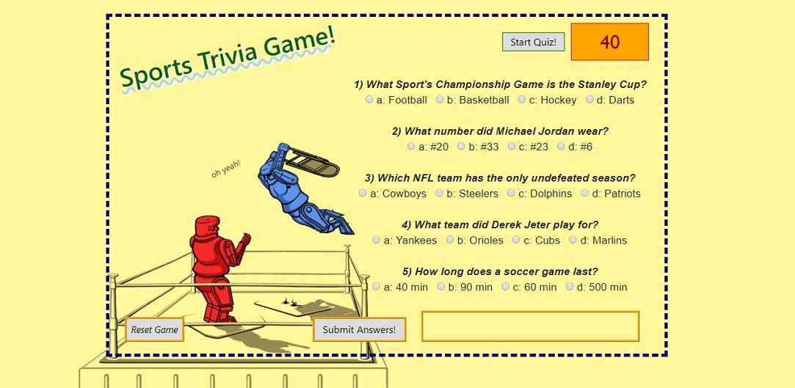
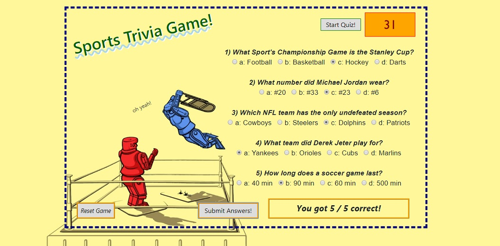

# Sports Trivia Game!
___

For this project, we were asked to create a themed trivia quiz with interactivity for the user, include a countdown timer, radio buttons (or only one answer that an user can give), and having the results show whether the user clicks on the submit button or the timer runs out.  My thought process for this game was to pseudo code the layout of the page and the necessary variables, functions and other aspects that I would need.  Then I chose to do a sports themed quiz with a simple HTML form layout with radio buttons, and cooresponding CSS to match the aesthetics I was looking for.  Also, buttons were added so that there was the ability for the user to 'start' the quiz, 'submit' their answers, and 'restart' the game.  Lastly, the JavaScript code was written and linked to add and aid in the interactivity of the quiz.

___

___

___

Using HTML and CSS I was able to create the feel of the quiz, and then coded out the rest of the project from there in JavaScript.  The few rough patches I hit with this project was initially collecting the values from the radio buttons, and then having the correct score (and in the right format) show up once the time ran out or the user submitted their answers.  Some help came from sites like StackOverflow, but collecting values from radio buttons are able to be done in various ways, so the most help I had was sitting down with Bryan and Aaron.  Then most of the help for the timer and other buttons actually came from our past activities and completed projects.  The other tough part of the coding of this project was sometimes mixing up JavaScript and jQuery code on my .js page.  In the future I will keep in mind both aspects of JavaScript and .js to keep pages loading faster, and to keep my code uniform.

## Built With

* [HTML]
* [JavaScript]
* [jQuery]

## Authors

* **Matt Williams** - *Initial work* - [M Williams Portfolio](https://mattwills09.github.io/portfolio.html)
